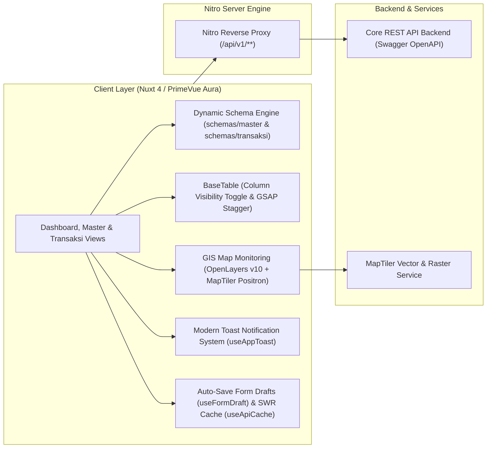

<div align="center">

# ⚡ TAMBORA WEB APPLICATION

### _Sistem Monitoring Operasional Pembangkit Listrik & Manajemen Data Terpadu_

**PT PLN (Persero) — Wilayah Sistem Tambora & Sumbawa**

---

[](https://nuxt.com/)
[](https://vuejs.org/)
[](https://primevue.org/)
[](https://tailwindcss.com/)
[](https://openlayers.org/)
[](https://www.typescriptlang.org/)
[](https://vitest.dev/)

</div>

---

## 📌 Ringkasan Eksekutif (_Overview_)

**Tambora Web App** adalah platform enterprise modern berbasis _Single Page & Server-Side Rendering (Universal SSR)_ yang dirancang khusus untuk memonitor stabilitas sistem ketenagalistrikan, neraca daya, dan tata kelola master data pembangkitan di lingkungan **PT PLN (Persero)**.

Platform ini mengintegrasikan pemetaan spasial geografis sentral pembangkit (GIS), analitik kurva beban _real-time_, mesin formulir dinamis (_Schema-Driven Dynamic Form Engine_), modul transaksi pencatatan daya dan anggaran, sistem otentikasi aman terintegrasi, fitur ketangguhan jaringan terpencil (_Low-Bandwidth Resilience & Form Auto-Save_), serta rangkaian animasi mikro modern berstandar enterprise (_60 FPS Hardware-Accelerated_).



---

## ✨ Fitur-Fitur Unggulan

| Modul                                      | Deskripsi & Kemampuan Teknis                                                                                                                                                                                                      |
| :----------------------------------------- | :-------------------------------------------------------------------------------------------------------------------------------------------------------------------------------------------------------------------------------- |
| **⚡ Dashboard Operasi**                   | Monitoring metrik real-time: **DMN** (Daya Mampu Nyata), **DMP** (Daya Mampu Pasok), **Beban Sistem**, **Unit Max**, dan **Cadangan Total/Putar**.                                                                                |
| **🗺️ GIS Sentral Map**                     | Peta interaktif berbasis **OpenLayers v10 + MapTiler Positron** dengan marker status visual (_Operasi_, _Gangguan_, _Pemeliharaan/Standby_), popup detail unit, dan filter wilayah.                                               |
| **📈 Analisis Beban & Grafik**             | Visualisasi kurva beban harian/mingguan dan tren neraca energi bertenaga **Apache ECharts**.                                                                                                                                      |
| **📶 Remote Resilience (Sumbawa Edition)** | **Auto-Save Form Drafts** (pencegah kehilangan ketikan saat sinyal mati), **SWR API Client Cache** (buka tabel instan 0ms), dan **Smart Network Retry** (otomatis coba ulang request saat koneksi drop).                          |
| **🎨 Modern GSAP & GPU Animations**        | Transisi halaman mulus (_Page Route Transitions_), efek baris tabel meluncur berjenjang (**GSAP Row Stagger**), **5-row Shimmer Skeleton Loader**, dan efek klik tombol membal (**Tactile Micro-Interactions**).                  |
| **🍞 Floating Toast & Form Guard**         | Sistem notifikasi mengambang pojok kanan atas dengan **Timer Countdown Progress Bar** (`useAppToast`), serta perlindungan data form (_Unsaved Changes Guard_ di `BaseFormModal.vue`).                                             |
| **📝 Dynamic Form Engine**                 | Formulir berbasis skema deklaratif di `schemas/master/` dan `schemas/transaksi/` dengan dukungan _conditional field visibility_ (`hidden`), _functional disabled_, dan validasi otomatis.                                         |
| **📊 Smart Data Table**                    | Komponen tabel terpadu (`BaseTable.vue`) dengan fitur **Show/Hide Kolom** (_Column Visibility Toggle_), filter pencarian instan, sorting dinamis, dan _local persistence_.                                                        |
| **🏛️ 8 Modul Master Data**                 | Tata kelola CRUD lengkap: _User_, _Role_, _Permission (Katalog Hak Akses)_, _Scope_, _Driver_, _Organisasi (Hierarki Parent-Child)_, _Sistem Pembangkit_, _Aset Mesin_, dan _Kondisi Mesin_.                                    |
| **⚡ Modul Transaksi Terpadu**             | Pencatatan operasional & keuangan: _Operasi Harian_, _Pemakaian Bahan Bakar_, _Pembebanan Generator_, _Pagu Anggaran (Tab Dinamis Unit & Bidang)_, _Prognosa Kinerja (PLTU & Non-PLTU)_, dan _Perhitungan NKO (KPI)_.         |
| **📥 Real Excel/CSV Export**               | Generator file spreadsheet asli (`utils/exportExcel.ts`) dengan standar **UTF-8 BOM** terintegrasi di seluruh tombol export tabel serta endpoint backend native export `.xls`.                                                    |
| **🛡️ Unified Modal Dialogs**               | Modal konfirmasi hapus modern (`BaseConfirmDialog`) dan modal sukses (`BaseSuccessModal`) menggantikan dialog native browser.                                                                                                     |
| **🔒 Enterprise Session Security**         | Deteksi inaktivitas (**28 menit idle + popup countdown 2 menit**), _Silent Token Refresh_ dengan _Single-Flight Mutex_ pada error 401, sinkronisasi multi-tab (_BroadcastChannel_), dan navigasi _Return-To_.                     |

---

## 🛠️ Arsitektur & Struktur Direktori

```text
tambora-frontend/
├── 📁 assets/             # Asset statis, logo branding PLN, dan style overrides
├── 📁 components/         # Arsitektur Komponen Atomic
│   ├── 📁 base/           # Core Base Components (BaseTable, BaseFormModal, BaseDateFilter, BaseMap, BaseChart, dll)
│   └── 📁 login/          # Komponen login, form credentials, dan typewriter animation
├── 📁 composables/        # State Management & Business Logic (Composables Pattern)
│   ├── 📁 master/         # CRUD Logic per entitas master (useUser, usePermission, useAsset, useDriver, dll)
│   └── 📁 transaksi/      # CRUD Logic transaksi (useOperasiHarian, usePagu, usePrognosa, dll)
├── 📁 docs/               # Dokumentasi Teknis Standar Proyek (PRD, Architecture, Schema, Rules, DeveloperGuide)
├── 📁 pages/              # Nuxt 4 File-Based Routing (home/dashboard, home/master, home/transaksi, login)
├── 📁 schemas/            # Definisi Skema Formulir Deklaratif
│   ├── 📁 master/         # 9 Berkas Skema Form Master (user, role, permission, driver, asset, system, dll)
│   └── 📁 transaksi/      # Berkas Skema Form Transaksi (operasi, pagu, pagu-bidang, prognosa, nko, dll)
├── 📁 stores/             # Pinia Global Store (auth: session, security, token)
├── 📁 test/               # Vitest Unit Test Suites & Testing Mocks
├── 📁 types/              # Modular TypeScript DTOs & Contracts
│   ├── form.types.ts      # Tipe field & section form
│   ├── table.types.ts     # Tipe kolom tabel & pagination
│   ├── auth.types.ts      # Tipe autentikasi & user session
│   ├── master.types.ts    # DTOs CRUD entitas master
│   ├── operasi.types.ts   # Tipe KPI operasi pembangkit
│   ├── transaksi.types.ts # DTOs CRUD entitas transaksi
│   └── index.ts           # Centralized Barrel Export
└── 📁 utils/              # Pure Utility Functions (formatNumber, exportExcel, authCrypto, dll)
```

---

## 🚀 Panduan Memulai (_Quick Start_)

### 1. Prasyarat Sistem

- **Node.js**: Versi `>= 20.11.0` (Disarankan Node.js LTS)
- **NPM**: Versi `>= 10.x` (atau pnpm / bun)

### 2. Instalasi Dependensi

```bash
# Clone repository
git clone git@github.com:aegis-immortal2/tambora-frontend.git

# Masuk ke direktori
cd tambora-frontend

# Install seluruh packages
npm install
```

### 3. Konfigurasi Environment (`.env`)

Buat berkas `.env` dari template `.env.example`:

```bash
cp .env.example .env
```

Sesuaikan variabel lingkungan:

```ini
# URL Backend Core API
NUXT_BACKEND_URL=http://localhost:8080

# MapTiler API Key (Layer Peta Resolusi Tinggi)
NUXT_PUBLIC_MAPTILER_KEY=your_maptiler_api_key_here
```

### 4. Menjalankan Aplikasi

```bash
# Development Mode (Hot-Reload)
npm run dev

# Production Build
npm run build

# Preview Production Build Lokal
npm run preview
```

> Akses aplikasi pada peramban web: **`http://localhost:3000`**

---

## 📋 Daftar Perintah NPM (_Scripts Matrix_)

| Command                     | Fungsi                                                                  |
| :-------------------------- | :---------------------------------------------------------------------- |
| **`npm run dev`**           | Menjalankan local development server Nuxt dengan Nitro proxy aktif.     |
| **`npm run build`**         | Mengompilasi aplikasi ke bundle production yang teroptimasi.            |
| **`npm run preview`**       | Menjalankan simulasi build production pada port lokal.                  |
| **`npm run test`**          | Menjalankan seluruh test suite menggunakan **Vitest**.                  |
| **`npm run test:coverage`** | Menjalankan testing dan menghasilkan laporan code coverage HTML & lcov. |
| **`npm run lint`**          | Memeriksa kepatuhan kode terhadap aturan ESLint (Clean Code Policy).    |

---

## 🧪 Quality Gate & Pengujian

Proyek ini menerapkan standar **SonarQube Grade A** dan **Clean Architecture Policy**:

```text
 ✓ test/utils/authCrypto.test.ts (5 tests)
 ✓ test/utils/exportExcel.test.ts (1 test)
 ✓ test/utils/apiError.test.ts (9 tests)
 ✓ test/utils/operasiPembangkitUtils.test.ts (3 tests)
 ✓ test/utils/formatNumber.test.ts (8 tests)
 ✓ test/composables/apiCache.test.ts (4 tests)
 ✓ test/composables/formDraft.test.ts (4 tests)
 ✓ test/composables/toast.test.ts (3 tests)
 ✓ test/composables/network.test.ts (1 test)
 ✓ test/stores/auth.test.ts (6 tests)
 ✓ test/composables/idleTimer.test.ts (3 tests)
 ✓ test/composables/master_phase3.test.ts (9 tests)
 ✓ test/composables/master.test.ts (8 tests)
 ✓ test/composables/transaksi.test.ts (8 tests)

 Test Files  14 passed (14)
      Tests  72 passed (72)
   Coverage  > 85% Code Coverage
   ESLint    0 Errors, 0 Warnings
```

---

## 📖 Dokumentasi Teknis

Untuk membaca pedoman arsitektur dan spesifikasi mendalam, silakan merujuk ke folder [`/docs`](docs/):

- 📘 [**Developer Guide**](docs/DeveloperGuide.md) — Panduan teknis & SOP 5 langkah membuat modul Master & Transaksi baru.
- 📄 [**Product Requirements Document (PRD)**](docs/PRD.md) — Spesifikasi kebutuhan bisnis dan alur operasional.
- 🏗️ [**System Architecture**](docs/Architecture.md) — Arsitektur layering, standar composable, dan security proxy.
- 📊 [**Data Schemas & Contracts**](docs/Schema.md) — Definisi tipe data domain, DTO, dan konfigurasi form/table.
- 📐 [**Development Rules & Standards**](docs/Rules.md) — Standar penulisan SFC Vue, anti-duplikasi, dan SonarQube rules.
- 📜 [**Changelog**](CHANGELOG.md) — Riwayat lengkap pembaruan versi dan penambahan fitur.

---

<div align="center">

**© 2026 PT PLN (Persero). All Rights Reserved.**  
_Developed with ❤️ for Excellence in National Power Generation Monitoring._

</div>
