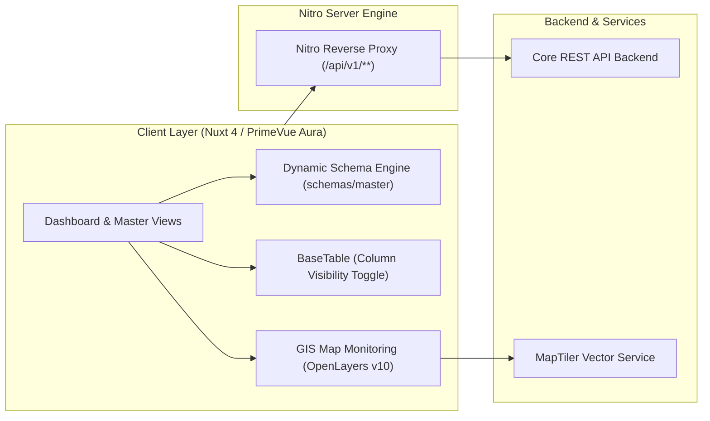

<div align="center">

# ⚡ TAMBORA WEB APPLICATION
### *Sistem Monitoring Operasional Pembangkit Listrik & Manajemen Data Terpadu*
**PT PLN (Persero) — Wilayah Sistem Tambora & Sumbawa**

---

[](https://nuxt.com/)
[](https://vuejs.org/)
[](https://primevue.org/)
[](https://tailwindcss.com/)
[](https://openlayers.org/)
[](https://www.typescriptlang.org/)
[](https://vitest.dev/)

</div>

---

## 📌 Ringkasan Eksekutif (*Overview*)

**Tambora Web App** adalah platform enterprise modern berbasis *Single Page & Server-Side Rendering (Universal SSR)* yang dirancang khusus untuk memonitor stabilitas sistem ketenagalistrikan, neraca daya, dan tata kelola master data pembangkitan di lingkungan **PT PLN (Persero)**.

Platform ini mengintegrasikan pemetaan spasial geografis sentral pembangkit (GIS), analitik kurva beban *real-time*, mesin formulir dinamis (*Schema-Driven Dynamic Form Engine*), serta sistem otentikasi aman terintegrasi.



---

## ✨ Fitur-Fitur Unggulan

| Modul | Deskripsi & Kemampuan Teknis |
| :--- | :--- |
| **⚡ Dashboard Operasi** | Monitoring metrik real-time: **DMN** (Daya Mampu Nyata), **DMP** (Daya Mampu Pasok), **Beban Sistem**, **Unit Max**, dan **Cadangan Total/Putar**. |
| **🗺️ GIS Sentral Map** | Peta interaktif berbasis **OpenLayers v10 + MapTiler** dengan marker status visual (*Operasi*, *Gangguan*, *Pemeliharaan/Standby*), popup detail unit, dan filter wilayah. |
| **📈 Analisis Beban & Grafik** | Visualisasi kurva beban harian/mingguan dan tren neraca energi bertenaga **Apache ECharts**. |
| **📝 Dynamic Form Engine** | Formulir berbasis skema deklaratif di `schemas/master/` dengan dukungan *conditional field visibility* (`hidden`), *functional disabled*, dan validasi **Zod**. |
| **📊 Smart Data Table** | Komponen tabel terpadu (`BaseTable.vue`) dengan fitur **Show/Hide Kolom** (*Column Visibility Toggle*), filter pencarian instan, sorting dinamis, dan *local persistence*. |
| **🏛️ 8 Modul Master Data** | Tata kelola CRUD lengkap: *User*, *Driver*, *Organisasi (Hierarki Parent-Child)*, *Sistem Pembangkit*, *Role & Permissions*, *Scope*, *Kondisi Mesin*, dan *Aset Mesin*. |
| **📥 Real Excel/CSV Export** | Generator file spreadsheet asli (`utils/exportExcel.ts`) dengan standar **UTF-8 BOM** terintegrasi di seluruh tombol export tabel. |
| **🛡️ Unified Modal Dialogs** | Modal konfirmasi hapus modern (`BaseConfirmDialog`) dan modal sukses (`BaseSuccessModal`) menggantikan dialog native browser. |

---

## 🛠️ Arsitektur & Struktur Direktori

```text
tambora-frontend/
├── 📁 assets/             # Asset statis, logo branding PLN, dan style overrides
├── 📁 components/         # Arsitektur Komponen Atomic
│   ├── 📁 base/           # Core Base Components (BaseTable, BaseFormModal, BaseMap, BaseChart, dll)
│   └── 📁 login/          # Komponen login, form credentials, dan typewriter animation
├── 📁 composables/        # State Management & Business Logic (Composables Pattern)
│   └── 📁 master/         # CRUD Logic per entitas master (useUser, useAsset, useDriver, dll)
├── 📁 docs/               # Dokumentasi Teknis Standar Proyek (PRD, Architecture, Schema, Rules)
├── 📁 pages/              # Nuxt 4 File-Based Routing (home/dashboard, home/master, login)
├── 📁 schemas/            # Definisi Skema Formulir Deklaratif
│   └── 📁 master/         # 8 Berkas Skema Form Master (user, driver, asset, system, dll)
├── 📁 stores/             # Pinia Global Stores (auth, session, transaksi)
├── 📁 test/               # Vitest Unit Test Suites & Testing Mocks
├── 📁 types/              # Modular TypeScript DTOs & Contracts
│   ├── form.types.ts      # Tipe field & section form
│   ├── table.types.ts     # Tipe kolom tabel & pagination
│   ├── auth.types.ts      # Tipe autentikasi & user session
│   ├── master.types.ts    # DTOs CRUD entitas master
│   ├── operasi.types.ts   # Tipe KPI operasi pembangkit
│   └── index.ts           # Centralized Barrel Export
└── 📁 utils/              # Pure Utility Functions (formatNumber, exportExcel, authCrypto, dll)
```

---

## 🚀 Panduan Memulai (*Quick Start*)

### 1. Prasyarat Sistem
* **Node.js**: Versi `>= 20.11.0` (Disarankan Node.js LTS)
* **NPM**: Versi `>= 10.x` (atau pnpm / bun)

### 2. Instalasi Dependensi
```bash
# Clone repository
git clone git@github.com:aegis-immortal2/tambora-frontend.git

# Masuk ke direktori
cd tambora-frontend

# Install seluruh packages
npm install
```

### 3. Konfigurasi Environment (`.env`)
Buat berkas `.env` dari template `.env.example`:

```bash
cp .env.example .env
```

Sesuaikan variabel lingkungan:
```ini
# URL Backend Core API
NUXT_BACKEND_URL=http://localhost:8080

# MapTiler API Key (Layer Peta Resolusi Tinggi)
NUXT_PUBLIC_MAPTILER_KEY=your_maptiler_api_key_here
```

### 4. Menjalankan Aplikasi
```bash
# Development Mode (Hot-Reload)
npm run dev

# Production Build
npm run build

# Preview Production Build Lokal
npm run preview
```
> Akses aplikasi pada peramban web: **`http://localhost:3000`**

---

## 📋 Daftar Perintah NPM (*Scripts Matrix*)

| Command | Fungsi |
| :--- | :--- |
| **`npm run dev`** | Menjalankan local development server Nuxt dengan Nitro proxy aktif. |
| **`npm run build`** | Mengompilasi aplikasi ke bundle production yang teroptimasi. |
| **`npm run preview`** | Menjalankan simulasi build production pada port lokal. |
| **`npm run test`** | Menjalankan seluruh test suite menggunakan **Vitest**. |
| **`npm run test:coverage`** | Menjalankan testing dan menghasilkan laporan code coverage HTML & lcov. |
| **`npm run lint`** | Memeriksa kepatuhan kode terhadap aturan ESLint (Clean Code Policy). |

---

## 🧪 Quality Gate & Pengujian

Proyek ini menerapkan standar **SonarQube Grade A** dan **Clean Architecture Policy**:

```text
 ✓ test/utils/exportExcel.test.ts (1 test)
 ✓ test/utils/apiError.test.ts (9 tests)
 ✓ test/utils/operasiPembangkitUtils.test.ts (3 tests)
 ✓ test/utils/authCrypto.test.ts (5 tests)
 ✓ test/utils/formatNumber.test.ts (8 tests)
 ✓ test/stores/auth.test.ts (6 tests)
 ✓ test/composables/master_phase3.test.ts (9 tests)
 ✓ test/composables/master.test.ts (8 tests)

 Test Files  8 passed (8)
      Tests  49 passed (49)
   Coverage  > 85% Code Coverage
   ESLint    0 Errors, 0 Warnings
```

---

## 📖 Dokumentasi Teknis

Untuk membaca pedoman arsitektur dan spesifikasi mendalam, silakan merujuk ke folder [`/docs`](docs/):

* 📄 [**Product Requirements Document (PRD)**](docs/PRD.md) — Spesifikasi kebutuhan bisnis dan alur operasional.
* 🏗️ [**System Architecture**](docs/Architecture.md) — Arsitektur layering, standar composable, dan security proxy.
* 📊 [**Data Schemas & Contracts**](docs/Schema.md) — Definisi tipe data domain, DTO, dan konfigurasi form/table.
* 📐 [**Development Rules & Standards**](docs/Rules.md) — Standar penulisan SFC Vue, anti-duplikasi, dan SonarQube rules.
* 📜 [**Changelog**](CHANGELOG.md) — Riwayat lengkap pembaruan versi dan penambahan fitur.

---

<div align="center">

**© 2026 PT PLN (Persero). All Rights Reserved.**  
*Developed with ❤️ for Excellence in National Power Generation Monitoring.*

</div>
