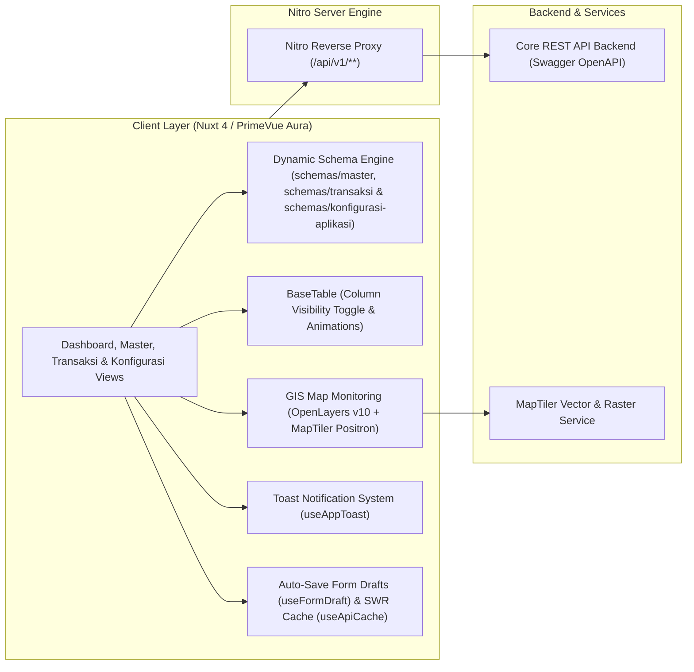

<div align="center">

# TAMBORA WEB APPLICATION

### _Sistem Monitoring Operasional Pembangkit Listrik & Manajemen Data Terpadu_

**PT PLN (Persero) — Wilayah Sistem Tambora & Sumbawa**

---

[](https://nuxt.com/)
[](https://vuejs.org/)
[](https://primevue.org/)
[](https://tailwindcss.com/)
[](https://openlayers.org/)
[](https://www.typescriptlang.org/)
[](https://vitest.dev/)

</div>

---

## Ringkasan Eksekutif (_Overview_)

**Tambora Web App** adalah aplikasi web berbasis _Single Page & Server-Side Rendering (Universal SSR)_ yang dirancang untuk memonitor stabilitas sistem ketenagalistrikan, neraca daya, dan pengelolaan data master pembangkitan di lingkungan **PT PLN (Persero)**.

Platform ini menyediakan pemetaan lokasi sentral pembangkit (GIS), visualisasi grafik beban, formulir dinamis berbasis skema, pencatatan transaksi operasional dan anggaran, sistem keamanan sesi pengguna, serta fitur penyimpanan draf otomatis formulir.



---

## Fitur-Fitur Unggulan

| Modul                                      | Deskripsi & Kemampuan Teknis                                                                                                                                                                                                      |
| :----------------------------------------- | :-------------------------------------------------------------------------------------------------------------------------------------------------------------------------------------------------------------------------------- |
| **Dashboard Operasi**                   | Monitoring metrik real-time: **DMN** (Daya Mampu Nyata), **DMP** (Daya Mampu Pasok), **Beban Sistem**, **Unit Max**, dan **Cadangan Total/Putar**.                                                                                |
| **GIS Sentral & Coordinate Picker**    | Peta interaktif berbasis **OpenLayers v10 + MapTiler Positron** dengan penanda status visual, popup detail unit, serta **Interactive Coordinate Picker** (sinkronisasi dua arah klik peta & input koordinat latitude/longitude desimal di form drawer Regional, Sistem, dan Organisasi). |
| **Analisis Beban & Grafik**             | Visualisasi kurva beban harian/mingguan dan tren neraca energi menggunakan **Apache ECharts**.                                                                                                                                    |
| **Remote Resilience & Smart Form Drafts** | **Auto-Save Form Drafts** (penyimpanan draf otomatis per ID/kode record dengan pencegahan banner palsu), **SWR API Client Cache** untuk pemuatan data instan, dan penanganan koneksi ulang otomatis saat jaringan terputus. |
| **UI Transitions, Motion & Clean Copy**  | Transisi perpindahan rute halaman, animasi tampilan baris tabel bertingkat, akordeon menu navigasi sidebar, serta standarisasi copywriting bersih tanpa AI buzzwords (*enterprise/seamless*). |
| **Floating Toast, LIFO Modal Esc & Guard** | Sistem notifikasi mengambang (`useAppToast`), penutupan modal bertumpuk berbasis LIFO saat menekan tombol `Esc`, serta konfirmasi pengaman perubahan belum tersimpan (_Unsaved Changes Guard_). |
| **Dynamic Form Engine & Strict Validation** | Formulir berbasis skema deklaratif di `schemas/master/`, `schemas/transaksi/`, dan `schemas/konfigurasi-aplikasi/` dengan evaluasi validasi presisi `required: true/false` (termasuk Latitude/Longitude pada `coordinate-picker` dan pencegahan array kosong pada multi-select). |
| **Smart Data Table & Pagination**       | Komponen tabel terpadu (`BaseTable.vue`) dengan sticky header, pengaturan sembunyikan/tampilkan kolom (_Column Visibility Toggle_), dan komponen paginasi halaman yang praktis. |
| **Standard Action Controls**            | Komponen kontrol standar: `<BaseCreateButton @click="openCreateModal" />` (label default `"TAMBAH DATA"`) dan `<BaseSearchInput v-model="searchQuery" />` (label default `"Cari Data"`). |
| **Modul Konfigurasi Aplikasi**          | Pengaturan hak akses pengguna: **Master Akses Level**, **Master Akses Grup** (kartu izin interaktif dengan switch On/Off, master switch toggle, dan filter modul), serta **Master Menu** (manajemen navigasi dinamis). |
| **16 Modul Master Data (SSOT Detail)** | Tata kelola CRUD lengkap dengan form drawer satu halaman tanpa tab dan modal detail SSOT (`:record="detailRecord"`): _Regional, Cabang, Ranting, UIW/UID, UIK, UP2D, UPK, Unit Layanan, Sentral Pembangkit, User (20-field & Hak Akses Khusus), Permission, Driver, Organisasi (GIS Map Picker & Async Detail SSOT), Sistem (GIS Map Picker & Async Detail), Aset Mesin, dan Kondisi Mesin_. |
| **Modul Transaksi Terpadu**             | Pencatatan operasional & keuangan: _Operasi Harian_, _Pemakaian Bahan Bakar_, _Pembebanan Generator_, _Pagu Anggaran (Tab Dinamis Unit & Bidang)_, _Prognosa Kinerja (PLTU & Non-PLTU)_, dan _Perhitungan NKO (KPI)_.         |
| **Dedicated Backend Export**            | Dukungan ekspor laporan spreadsheet resmi dari endpoint backend (`/api/v1/pagu/export`, `/api/v1/prognosa/export`, `/api/v1/nko/export`).                                                                                          |
| **Unified Modal Dialogs & Transition**  | Modal konfirmasi hapus terpadu (`BaseConfirmDialog`), modal sukses (`BaseSuccessModal` dengan jeda transisi 150ms), dan Single Source of Truth (`BaseDetailModal`) untuk metadata riwayat audit. |
| **Isolasi State Loading Tabel**        | Penanganan state loading mutasi terisolasi di composable (`create`, `update`, `delete`), mencegah tabel berkedip saat terjadi error validasi pada form drawer. |
| **Keamanan Sesi & Pemantau Inaktivasi** | Deteksi inaktivitas berbasis selisih waktu sistem (`Date.now()`) dengan dialog peringatan 2 menit sebelum logout otomatis, perpanjangan token otomatis di latar belakang, sinkronisasi multi-tab, dan pengembalian rute login. |

---

## Arsitektur & Struktur Direktori

```text
tambora-frontend/
├── assets/             # Asset statis, logo branding PLN, dan style overrides
├── components/         # Arsitektur Komponen Atomic
│   ├── base/           # Core Base Components (BaseTable, BaseFormModal, BaseCreateButton, BaseDateFilter, BaseMap, dll)
│   └── login/          # Komponen login, form credentials, dan typewriter animation
├── composables/        # State Management & Business Logic (Composables Pattern)
│   ├── konfigurasi-aplikasi/ # useAksesLevel, useAksesGrup, useMenu
│   ├── master/         # CRUD Logic per entitas master (useRegional, useUiwUid, useUik, useUp2d, useUpk, useUnitLayanan, useSentral, useUser, usePermission, useAsset, dll)
│   └── transaksi/      # CRUD Logic transaksi (useOperasiHarian, usePagu, usePrognosa, dll)
├── docs/               # Dokumentasi Teknis Standar Proyek (PRD, Architecture, Schema, Rules, DeveloperGuide)
├── pages/              # Nuxt 4 File-Based Routing (home/dashboard, home/konfigurasi-aplikasi, home/master, home/transaksi, login)
├── schemas/            # Definisi Skema Formulir Deklaratif
│   ├── konfigurasi-aplikasi/ # Skema Form Akses Level, Akses Grup, Menu
│   ├── master/         # Berkas Skema Form Master (regional, uiw-uid, uik, up2d, upk, unit-layanan, sentral, user, asset, system, dll)
│   └── transaksi/      # Berkas Skema Form Transaksi (operasi, pagu, pagu-bidang, prognosa, nko, dll)
├── stores/             # Pinia Global Store (auth: session, security, token)
├── test/               # Vitest Unit Test Suites & Testing Mocks (122 Tests Passed 100%)
├── types/              # Modular TypeScript DTOs & Contracts
│   ├── form.types.ts      # Tipe field & section form
│   ├── table.types.ts     # Tipe kolom tabel & pagination
│   ├── auth.types.ts      # Tipe autentikasi & user session
│   ├── master.types.ts    # DTOs CRUD entitas master & unit PLN
│   ├── operasi.types.ts   # Tipe KPI operasi pembangkit
│   ├── transaksi.types.ts # DTOs CRUD entitas transaksi
│   └── index.ts           # Centralized Barrel Export
└── utils/              # Pure Utility Functions (formatNumber, exportExcel, authCrypto, dll)
```

---

## Panduan Memulai (_Quick Start_)

### 1. Prasyarat Sistem

- **Node.js**: Versi `>= 20.11.0` (Disarankan Node.js LTS)
- **NPM**: Versi `>= 10.x` (atau pnpm / bun)

### 2. Instalasi Dependensi

```bash
# Clone repository
git clone git@github.com:aegis-immortal2/tambora-frontend.git

# Masuk ke direktori
cd tambora-frontend

# Install seluruh packages
npm install
```

### 3. Konfigurasi Environment (`.env`)

Buat berkas `.env` dari template `.env.example`:

```bash
cp .env.example .env
```

Sesuaikan variabel lingkungan:

```ini
# URL Backend Core API
NUXT_BACKEND_URL=http://localhost:8080

# MapTiler API Key (Layer Peta Resolusi Tinggi)
NUXT_PUBLIC_MAPTILER_KEY=your_maptiler_api_key_here
```

### 4. Menjalankan Aplikasi

```bash
# Development Mode (Hot-Reload)
npm run dev

# Production Build
npm run build

# Preview Production Build Lokal
npm run preview
```

> Akses aplikasi pada peramban web: **`http://localhost:3000`**

---

## Daftar Perintah NPM (_Scripts Matrix_)

| Command                     | Fungsi                                                                  |
| :-------------------------- | :---------------------------------------------------------------------- |
| **`npm run dev`**           | Menjalankan local development server Nuxt dengan Nitro proxy aktif.     |
| **`npm run build`**         | Mengompilasi aplikasi ke bundle production yang teroptimasi.            |
| **`npm run preview`**       | Menjalankan simulasi build production pada port lokal.                  |
| **`npm run test`**          | Menjalankan seluruh test suite menggunakan **Vitest**.                  |
| **`npm run test:coverage`** | Menjalankan testing dan menghasilkan laporan code coverage HTML & lcov. |
| **`npm run lint`**          | Memeriksa kepatuhan kode terhadap aturan ESLint (Clean Code Policy).    |

---

## Quality Gate & Pengujian

Proyek ini menerapkan standar **SonarQube Grade A** dan **Clean Architecture Policy**:

```text
 ✓ test/utils/deviceMeta.test.ts (13 tests)
 ✓ test/utils/exportExcel.test.ts (5 tests)
 ✓ test/utils/apiError.test.ts (9 tests)
 ✓ test/schemas/userSchema.test.ts (6 tests)
 ✓ test/utils/authCrypto.test.ts (5 tests)
 ✓ test/composables/master_phase3.test.ts (9 tests)
 ✓ test/utils/formatNumber.test.ts (8 tests)
 ✓ test/composables/tableState.test.ts (5 tests)
 ✓ test/composables/konfigurasiAplikasi.test.ts (6 tests)
 ✓ test/composables/master.test.ts (14 tests)
 ✓ test/composables/transaksi.test.ts (8 tests)
 ✓ test/composables/masterUnitPLN.test.ts (8 tests)
 ✓ test/composables/apiCache.test.ts (4 tests)
 ✓ test/stores/auth.test.ts (6 tests)
 ✓ test/composables/idleTimer.test.ts (3 tests)
 ✓ test/utils/operasiPembangkitUtils.test.ts (3 tests)
 ✓ test/composables/toast.test.ts (3 tests)
 ✓ test/composables/formDraft.test.ts (4 tests)
 ✓ test/composables/menu.test.ts (2 tests)
 ✓ test/composables/network.test.ts (1 test)

 Test Files  20 passed (20)
      Tests  122 passed (122)
   Coverage  > 85% Code Coverage
   ESLint    0 Errors, 0 Warnings
```

---

## Dokumentasi Teknis

Untuk membaca pedoman arsitektur dan spesifikasi mendalam, silakan merujuk ke folder [`/docs`](docs/):

- [**Developer Guide**](docs/DeveloperGuide.md) — Panduan teknis & SOP 5 langkah membuat modul Master & Transaksi baru.
- [**Product Requirements Document (PRD)**](docs/PRD.md) — Spesifikasi kebutuhan bisnis dan alur operasional.
- [**System Architecture**](docs/Architecture.md) — Arsitektur layering, standar composable, dan security proxy.
- [**Data Schemas & Contracts**](docs/Schema.md) — Definisi tipe data domain, DTO, dan konfigurasi form/table.
- [**Development Rules & Standards**](docs/Rules.md) — Standar penulisan SFC Vue, anti-duplikasi, dan SonarQube rules.
- [**Changelog**](CHANGELOG.md) — Riwayat lengkap pembaruan versi dan penambahan fitur.

---

<div align="center">

**© 2026 PT PLN (Persero). All Rights Reserved.**

</div>
