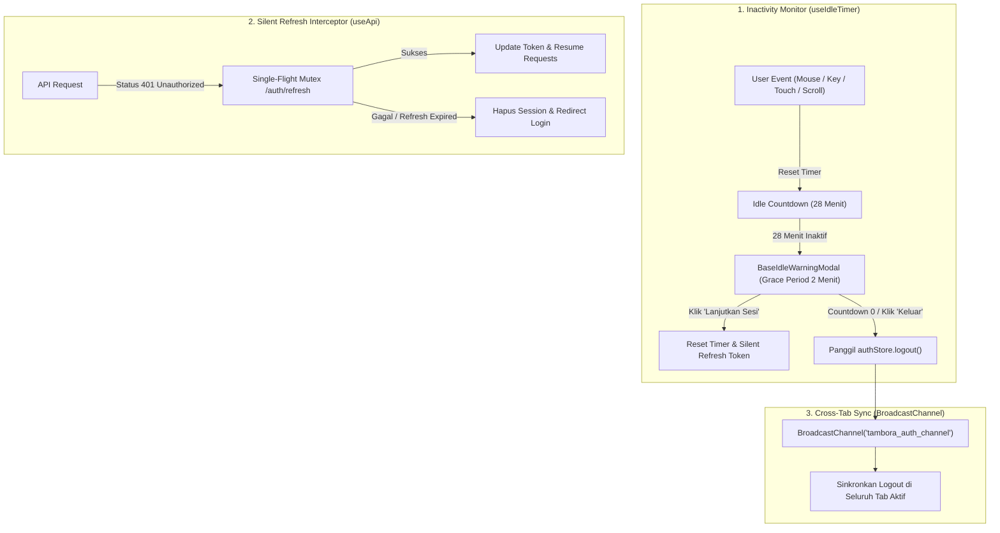

# System Architecture — Tambora Web App

## 1. Tech Stack
- **Framework**: Nuxt 4 (Vue 3 Composition API + `<script setup>`)
- **State Management**: Pinia
- **UI Library & Components**: Nuxt UI, PrimeVue (v4 Aura Theme), Nuxt Lucide Icons, Vue Final Modal
- **GIS / Mapping**: OpenLayers (`ol` v10) + MapTiler Positron Vector/Raster Tiles
- **Data Visualization**: Apache ECharts (`echarts` + `vue-echarts`)
- **Form & Validation**: Schema-Driven Declarative Form Engine (`schemas/master/` & `schemas/transaksi/`)
- **Testing**: Vitest + @vue/test-utils + Happy-DOM (Coverage: @vitest/coverage-v8) — **112/112 Tests Passing (100% Green)**
- **Code Quality**: Strict ESLint + SonarQube Quality Gate Grade A

---

## 2. Layering Architecture

```text
┌─────────────────────────────────────────────────────────────┐
│                       Pages / Views                         │
│  (pages/home/dashboard, pages/home/konfigurasi-aplikasi,    │
│   pages/home/master, pages/home/transaksi)                  │
└──────────────┬───────────────────────────────┬──────────────┘
               │                               │
               ▼                               ▼
┌───────────────────────────────┐ ┌───────────────────────────┐
│     Composables & Stores      │ │      Schemas Layer        │
│  (useAksesLevel, useAksesGrup,│ │  (schemas/konfigurasi-    │
│   useOperasiHarian, usePagu,  │ │   aplikasi/*.ts,          │
│   useIdleTimer, useAppToast,  │ │   schemas/master/*.ts,    │
│   useNetwork, useAuthStore,   │ │   schemas/transaksi/*.ts) │
│   Pinia Stores)               │ │                           │
└──────────────┬────────────────┘ └─────────────┬─────────────┘
               │                                │
               ▼                                ▼
┌─────────────────────────────────────────────────────────────┐
│               Base UI Components (Generic)                  │
│  (BaseTable, BaseFormModal, BaseMap, BaseToastContainer)    │
└──────────────┬──────────────────────────────────────────────┘
               │
               ▼
┌─────────────────────────────────────────────────────────────┐
│               Pure Utils & Data Fetching                    │
│  (utils/exportExcel, utils/apiError, Nitro Proxy /api/v1)   │
└─────────────────────────────────────────────────────────────┘
```

---

## 3. Enterprise Session Security Architecture



---

## 4. Modern UI/UX Animation & Notification Architecture

```mermaid
flowchart TD
    subgraph ANIM_SUITE["1. High-Impact Animations"]
        PAGES["Page Navigation"] -->|GPU Cubic-Bezier| PAGE_TRANS["Smooth Fade & Slide-Up 6px"]
        DATA_LOAD["API Data Arrived"] -->|GSAP gsap.fromTo()| STAGGER["Table Rows Cascade (20ms Stagger)"]
        LOADING["Table Loading"] -->|Tailwind Gradient Wave| SKELETON["5-Row Shimmer Skeleton Loader"]
        CLICKS["Button Click"] -->|Spring Active Scale| TACTILE["Tactile Feedback (active:scale-90)"]
    end

    subgraph SAFETY_FEEDBACK["2. Data Safety & Global Toast"]
        FORM_DIRTY["Form Input Modified"] -->|Close Attempt| GUARD["Unsaved Changes Guard Dialog"]
        CRUD_ACTION["API Success / Error"] -->|useAppToast()| TOAST["BaseToastContainer (Animated Progress Bar)"]
    end
```

---

## 5. Remote Resilience & Low-Bandwidth Architecture (Sumbawa Ready)

```mermaid
flowchart TD
    subgraph DRAFT_SYSTEM["1. Form Draft Auto-Save (useFormDraft)"]
        INPUT["Operator Typings in Form"] -->|Debounce 500ms| LOCAL_STORAGE["Browser LocalStorage (Same-Origin Isolated)"]
        BROWSER_CLOSE["Browser Crash / Tab Closed"] --> OPEN_MODAL["Modal Form Opened Again"]
        LOCAL_STORAGE -->|Detect Existing Draft| DRAFT_BANNER["Draft Recovery Banner"]
        DRAFT_BANNER -->|Klik 'Pulihkan'| RESTORE["Populate Form Inputs"]
        DRAFT_BANNER -->|Klik 'Abaikan' / Submit 200 OK| PURGE["Auto-Purge Storage"]
    end

    subgraph CACHE_SYSTEM["2. SWR API Caching (useApiCache)"]
        NAV_PAGE["User Switches Tabs"] --> CHECK_CACHE{"Cache Hit?"}
        CHECK_CACHE -->|Yes| INSTANT_UI["Serve Instant Data (0ms)"]
        INSTANT_UI --> BG_FETCH["Background Silent Revalidate"]
        CHECK_CACHE -->|No| NET_FETCH["Fetch API from Server"]
        BG_FETCH --> UPDATE_CACHE["Update Cache & State"]
        NET_FETCH --> UPDATE_CACHE
        MUTATION["Create / Edit / Delete Action"] -->|Invalidate Prefix| PURGE_CACHE["Invalidate Cache & Fetch Fresh Data"]
    end

    subgraph RETRY_SYSTEM["3. Smart Network Retry (useApi)"]
        API_ERR["Server Gateway Timeout / RTO (408, 500-504)"] --> RETRY_CHECK{"Retry Count < 2?"}
        RETRY_CHECK -->|Yes| BACKOFF["Wait 1000ms & Retry Request"]
        RETRY_CHECK -->|No| TOAST_ERR["Display Elegant Error Toast"]
    end
```



---

## 6. Core Architectural Principles
1. **Separation of Concerns**:
   - **`/components/base`**: Komponen murni generik, tidak boleh memiliki keterikatan bisnis (hanya menerima props/emits/slots).
   - **`/composables`**: State reaktif, business logic, dan orkestrasi data fetching (`useApi`, `useIdleTimer`, `useAppToast`, `useFormDraft`, `useApiCache`, composable CRUD).
   - **`/schemas`**: Definisi declarative schema untuk seluruh form master (`schemas/master/*.schema.ts`) dan transaksi (`schemas/transaksi/*.schema.ts`).
   - **`/config`**: Konfigurasi navigasi terisolasi (`config/navigation.ts`).
   - **`/utils`**: Pure functions tanpa side-effects (mudah di-unit test secara terisolasi).
2. **Data Fetching & Proxy Standards**:
   - Wajib menggunakan composable terpusat `useApi()` atau bawaan Nuxt (`$fetch` / `useFetch`). Dilarang memakai `axios`.
   - Menggunakan dynamic Nitro reverse proxy (`/api/v1/**`) di `nuxt.config.ts` untuk menangani routing backend dan bypass CORS.
   - Error handling terpusat otomatis memicu notifikasi Toast dan penanganan silent refresh / auto-logout saat 401 Unauthorized.
3. **Quality & Maintainability**:
   - Code Duplication dijaga di bawah 3% sesuai aturan SonarQube.
   - Semua fungsi `utils`, `composables`, dan `stores` wajib memiliki unit test di folder `test/` (Target Coverage > 80%).
4. **Performance & Bundling**:
   - Animasi wajib memanfaatkan **Hardware Acceleration (GPU)** lewat `transform` dan `opacity` dengan auto `clearProps` pada GSAP.
   - Library berat (OpenLayers GIS `ol/*` & Apache ECharts) di-prebundle melalui `vite.optimizeDeps` untuk menjamin navigasi instan.


