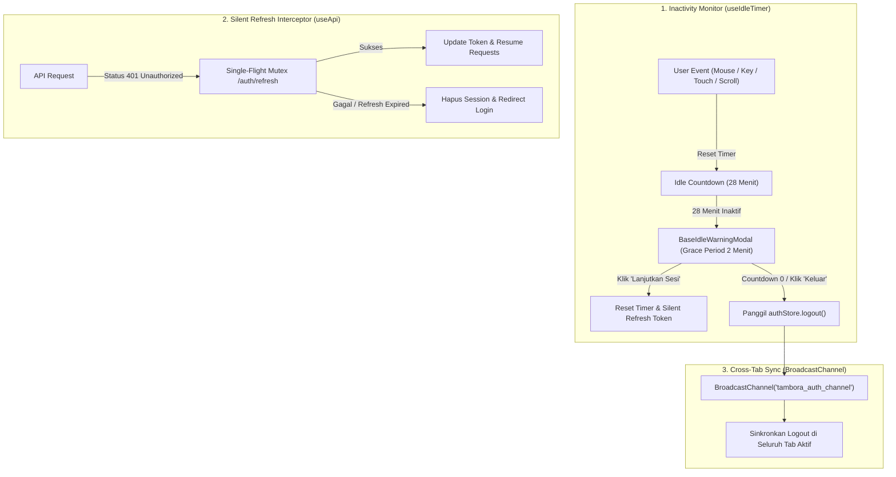

# System Architecture — Tambora Web App

## 1. Tech Stack
- **Framework**: Nuxt 4 (Vue 3 Composition API + `<script setup>`)
- **State Management**: Pinia
- **UI Library & Components**: Nuxt UI, PrimeVue (v4 Aura Theme), Nuxt Lucide Icons, Vue Final Modal
- **GIS / Mapping**: OpenLayers (`ol` v10) + MapTiler Positron Vector/Raster Tiles
- **Data Visualization**: Apache ECharts (`echarts` + `vue-echarts`)
- **Form & Validation**: Schema-Driven Declarative Form Engine (`schemas/master/` & `schemas/transaksi/`)
- **Testing**: Vitest + @vue/test-utils + Happy-DOM (Coverage: @vitest/coverage-v8) — **60/60 Tests Passing (100% Green)**
- **Code Quality**: Strict ESLint + SonarQube Quality Gate Grade A

---

## 2. Layering Architecture

```text
┌─────────────────────────────────────────────────────────────┐
│                       Pages / Views                         │
│  (pages/home/dashboard, pages/home/master, pages/home/transaksi)
└──────────────┬───────────────────────────────┬──────────────┘
               │                               │
               ▼                               ▼
┌───────────────────────────────┐ ┌───────────────────────────┐
│     Composables & Stores      │ │      Schemas Layer        │
│  (useOperasiHarian, usePagu,  │ │  (schemas/master/*.ts,    │
│   useIdleTimer, useApi,       │ │   schemas/transaksi/*.ts, │
│   useAuthStore, Pinia Stores) │ │   types/*.types.ts)       │
└──────────────┬────────────────┘ └─────────────┬─────────────┘
               │                                │
               ▼                                ▼
┌─────────────────────────────────────────────────────────────┐
│               Base UI Components (Generic)                  │
│  (BaseTable, BaseFormModal, BaseMap, BaseIdleWarningModal)  │
└──────────────┬──────────────────────────────────────────────┘
               │
               ▼
┌─────────────────────────────────────────────────────────────┐
│               Pure Utils & Data Fetching                    │
│  (utils/exportExcel, utils/apiError, Nitro Proxy /api/v1)   │
└─────────────────────────────────────────────────────────────┘
```

---

## 3. Enterprise Session Security Architecture



---

## 4. Core Architectural Principles
1. **Separation of Concerns**:
   - **`/components/base`**: Komponen murni generik, tidak boleh memiliki keterikatan bisnis (hanya menerima props/emits/slots).
   - **`/composables`**: State reaktif, business logic, dan orkestrasi data fetching (`useApi`, `useIdleTimer`, composable CRUD).
   - **`/schemas`**: Definisi declarative schema untuk seluruh form master (`schemas/master/*.schema.ts`) dan transaksi (`schemas/transaksi/*.schema.ts`).
   - **`/utils`**: Pure functions tanpa side-effects (mudah di-unit test secara terisolasi).
2. **Data Fetching & Proxy Standards**:
   - Wajib menggunakan composable terpusat `useApi()` atau bawaan Nuxt (`$fetch` / `useFetch`). Dilarang memakai `axios`.
   - Menggunakan dynamic Nitro reverse proxy (`/api/v1/**`) di `nuxt.config.ts` untuk menangani routing backend dan bypass CORS.
   - Error handling terpusat otomatis memicu notifikasi Toast PrimeVue dan penanganan silent refresh / auto-logout saat 401 Unauthorized.
3. **Quality & Maintainability**:
   - Code Duplication dijaga di bawah 3% sesuai aturan SonarQube.
   - Semua fungsi `utils`, `composables`, dan `stores` wajib memiliki unit test di folder `test/` (Target Coverage > 80%).
4. **Performance & Bundling**:
   - Library berat (OpenLayers GIS `ol/*` & Apache ECharts) di-prebundle melalui `vite.optimizeDeps` untuk menjamin navigasi instan.
   - Sidebar navigasi menggunakan `prefetch` pada `<NuxtLink>` untuk asynchronous chunk loading.
