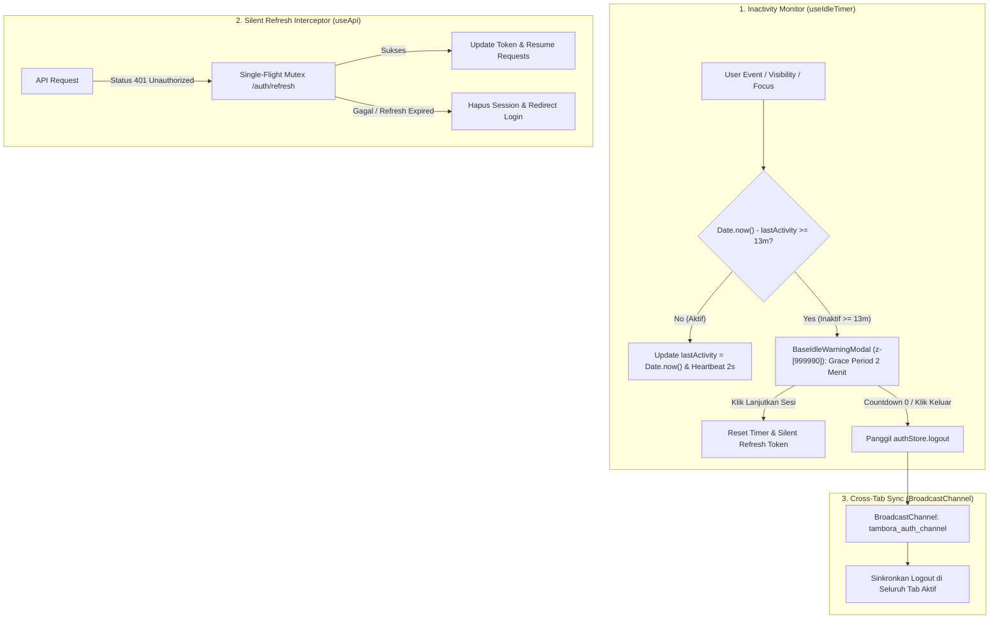
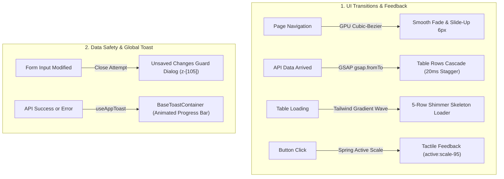
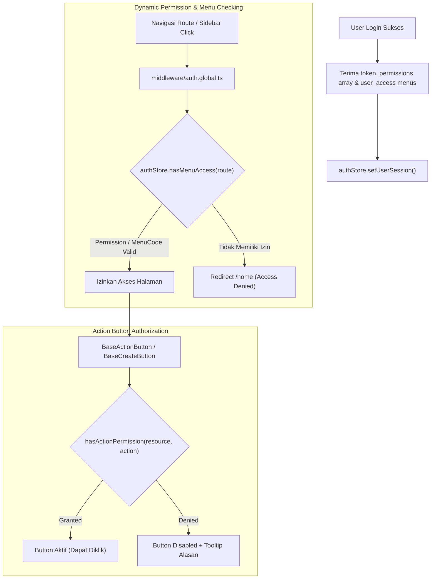
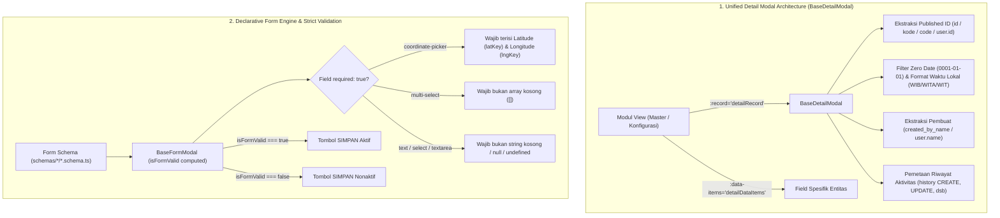

# System Architecture — Tambora Web App

## 1. Tech Stack
- **Framework**: Nuxt 4 (Vue 3 Composition API + `<script setup>`)
- **State Management**: Pinia
- **UI Library & Components**: Nuxt UI, PrimeVue (v4 Aura Theme), Nuxt Lucide Icons, Vue Final Modal
- **GIS / Mapping**: OpenLayers (`ol` v10) + MapTiler Positron Vector/Raster Tiles
- **Data Visualization**: Apache ECharts (`echarts` + `vue-echarts`)
- **Form & Validation**: Schema-Driven Declarative Form Engine (`schemas/master/`, `schemas/transaksi/`, `schemas/konfigurasi-aplikasi/`)
- **Testing**: Vitest + @vue/test-utils + Happy-DOM (Coverage: @vitest/coverage-v8) — **148/148 Tests Passing (100% Green)**
- **Code Quality**: Strict ESLint + SonarQube Quality Gate Grade A

---

## 2. Layering Architecture

```text
┌─────────────────────────────────────────────────────────────┐
│                       Pages / Views                         │
│  (pages/home/dashboard, pages/home/konfigurasi-aplikasi,    │
│   pages/home/master, pages/home/transaksi)                  │
└──────────────┬───────────────────────────────┬──────────────┘
               │                               │
               ▼                               ▼
┌───────────────────────────────┐ ┌───────────────────────────┐
│     Composables & Stores      │ │      Schemas Layer        │
│  (useAksesLevel, useMenu,     │ │  (schemas/konfigurasi-    │
│   useRegional, useSentral,    │ │   aplikasi/*.ts,          │
│   useOperasiHarian, usePagu,  │ │   schemas/master/*.ts,    │
│   useIdleTimer, useAppToast,  │ │   schemas/transaksi/*.ts) │
│   useNetwork, useAuthStore,   │ │                           │
│   Pinia Stores)               │ │                           │
└──────────────┬────────────────┘ └─────────────┬─────────────┘
               │                                │
               ▼                                ▼
┌─────────────────────────────────────────────────────────────┐
│               Base UI Components (Generic)                  │
│  (BaseTable, BaseFormModal, BaseMap, BaseToastContainer)    │
└──────────────┬──────────────────────────────────────────────┘
               │
               ▼
┌─────────────────────────────────────────────────────────────┐
│               Pure Utils & Data Fetching                    │
│  (utils/exportExcel, utils/apiError, Nitro Proxy /api/v1)   │
└─────────────────────────────────────────────────────────────┘
```

---

## 3. Arsitektur Keamanan Sesi



---

## 4. Arsitektur Transisi UI & Notifikasi



---

## 5. Remote Resilience & Low-Bandwidth Architecture (Sumbawa Ready)

```mermaid
flowchart TD
    subgraph DRAFT_SYSTEM["1. Universal Form Draft (useFormDraft & BaseFormModal)"]
        INPUT["Operator Typings in Form"] -->|"Debounce 500ms"| LOCAL_STORAGE["Browser LocalStorage (route + universal pk)"]
        BROWSER_CLOSE["Browser Crash or Tab Closed"] --> OPEN_MODAL["Modal Form Opened Again"]
        LOCAL_STORAGE -->|"Semantic Diff & Valid Content"| DRAFT_BANNER["Draft Recovery Banner (Formatted Time & TTL 24h)"]
        DRAFT_BANNER -->|"Klik Pulihkan"| RESTORE["Populate Form Inputs"]
        DRAFT_BANNER -->|"Klik Abaikan / Buang / Submit OK"| PURGE["Auto-Purge Storage & Reset Clean State"]
    end

    subgraph CACHE_SYSTEM["2. SWR API Caching (useApiCache)"]
        NAV_PAGE["User Switches Tabs"] --> CHECK_CACHE{"Cache Hit?"}
        CHECK_CACHE -->|"Yes"| INSTANT_UI["Serve Instant Data (0ms)"]
        INSTANT_UI --> BG_FETCH["Background Silent Revalidate"]
        CHECK_CACHE -->|"No"| NET_FETCH["Fetch API from Server"]
        BG_FETCH --> UPDATE_CACHE["Update Cache & State"]
        NET_FETCH --> UPDATE_CACHE
        MUTATION["Create or Edit or Delete Action"] -->|"Invalidate Prefix"| PURGE_CACHE["Invalidate Cache & Fetch Fresh Data"]
    end

    subgraph RETRY_SYSTEM["3. Smart Network Retry (useApi)"]
        API_ERR["Server Gateway Timeout / RTO (408, 500-504)"] --> RETRY_CHECK{"Retry Count < 2?"}
        RETRY_CHECK -->|"Yes"| BACKOFF["Wait 1000ms & Retry Request"]
        RETRY_CHECK -->|"No"| TOAST_ERR["Display Error Toast"]
    end
```



---

## 6. Frontend RBAC & Dynamic Menu Resolution Architecture



---

## 7. Single Source of Truth (SSOT) Detail Modal & Strict Form Validation Engine



---

## 8. Core Architectural Principles
1. **Separation of Concerns**:
   - **`/components/base`**: Komponen murni generik, tidak boleh memiliki keterikatan bisnis (hanya menerima props/emits/slots).
   - **`/composables`**: State reaktif, business logic, dan orkestrasi data fetching (`useApi`, `useIdleTimer`, `useAppToast`, `useFormDraft`, `useApiCache`, composable CRUD).
   - **`/schemas`**: Definisi declarative schema untuk seluruh form master (`schemas/master/*.schema.ts`), transaksi (`schemas/transaksi/*.schema.ts`), dan konfigurasi (`schemas/konfigurasi-aplikasi/*.schema.ts`).
   - **`/config`**: Konfigurasi navigasi terisolasi (`config/navigation.ts`).
   - **`/utils`**: Pure functions tanpa side-effects (mudah di-unit test secara terisolasi).
2. **Data Fetching & Proxy Standards**:
   - Wajib menggunakan composable terpusat `useApi()` atau bawaan Nuxt (`$fetch` / `useFetch`). Dilarang memakai `axios`.
   - Menggunakan dynamic Nitro reverse proxy (`/api/v1/**`) di `nuxt.config.ts` untuk menangani routing backend dan bypass CORS.
   - Error handling terpusat otomatis memicu notifikasi Toast dan penanganan silent refresh / auto-logout saat 401 Unauthorized.
   - State loading mutasi (`create`, `update`, `delete`) diisolasi pada form drawer (`submitting.value`) tanpa mengganggu `loading.value` tabel latar belakang.
3. **Quality & Maintainability**:
   - Code Duplication dijaga di bawah 3% sesuai aturan SonarQube.
   - Semua fungsi `utils`, `composables`, dan `stores` wajib memiliki unit test di folder `test/` (Target Coverage > 80%).
4. **Performance & Bundling**:
   - Animasi wajib memanfaatkan **Hardware Acceleration (GPU)** lewat `transform` dan `opacity` dengan auto `clearProps` pada GSAP.
   - Library berat (OpenLayers GIS `ol/*` & Apache ECharts) di-prebundle melalui `vite.optimizeDeps` untuk menjamin navigasi instan.
